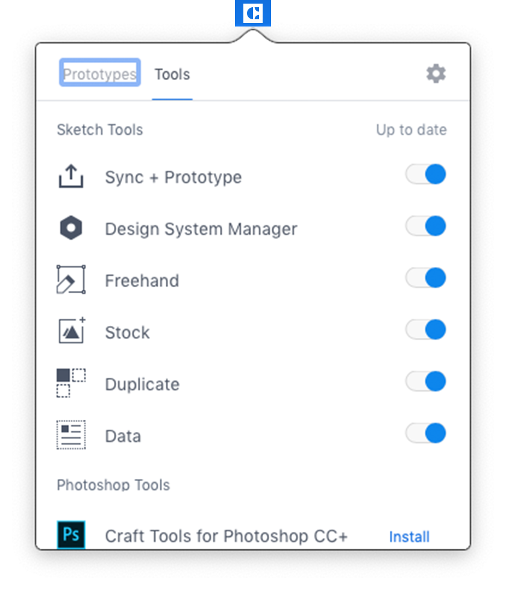
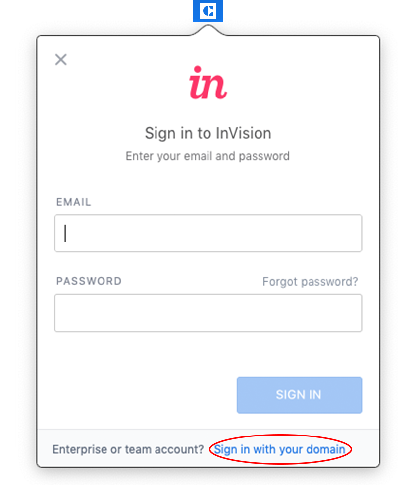

# Getting started - designer guide

## Tools

### Setting up Sketch

[Sketch](https://www.sketchapp.com/) is the primary tool used by the TELUS Design team to mock up designs. It’s an application tool that is only available on Mac OS and is fairly easy to pick up. Sketch offers quite a few [tutorials](https://medium.com/sketch-app-sources/helpful-guide-to-getting-started-with-sketch-ecab4b5738bb) to help you get started.

You will need Sketch set up on your computer before starting any project. Please be sure to keep your Sketch app up to date with the [latest Sketch release](https://www.sketchapp.com/updates/).

**For TELUS designers**:

You should have been given a Sketch license during your onboarding. If not, you can [download a trial version](https://www.sketchapp.com/) of the latest Sketch app and then contact [@BrianLam1](mailto:Brian.Lam1@telus.com) from the Design Strategy team for a license.

For vendors or designers outside of TELUS Digital, you can purchase and [download Sketch](https://www.sketchapp.com/pricing/) for $99/year.

### Sketch Plugins

There are a variety of plugins available for Sketch. Here is a short list of plugins that will be useful when setting up your Sketch file and using the Design System Manager (DSM) component library:

#### Required

- [Craft Manager](https://www.invisionapp.com/craft): Suite of plugins by Invision to help streamline your workflow. (**Note:** This is required to use the DSM Component library)

- [Launchpad by Anima](https://animaapp.github.io/): Customize designs with responsive settings (**Note**: Without this plugin, some of the responsive components will not work properly)

- [Paddy](https://github.com/DWilliames/paddy-sketch-plugin): Create components with fixed padding (**Note**: Used for automatic resizing of our button component)

#### Recommended

- [Sketch Toolbox](http://sketchtoolbox.com/): Manage and install your Sketch plugins

- [Shared Text Styles](http://www.textstyl.es/): Import/export text styles within your Sketch files

- [Nudge Push Shove](http://nudgepushshove.com/): Set up custom nudge settings

- [Dynamic Button](https://github.com/fuggfuggfugg/sketch-dynamic-button-3.5): Create components with fixed padding

## Setting up Invision

From design to prototyping, the TELUS Design team uses Invision suite of apps to help with our design workflow and to assist with collaboration. You can use InVision to share your prototypes and Craft Sync to sync up your designs.

During your initial onboarding to the design team, you should have gotten an invitation sent to your TELUS email to set up a [TELUS Invision Enterprise](https://projects.invisionapp.com/d/login) account. If you haven’t please contact your design lead, or your InVision administrator ([@brianlam1](mailto:brian.lam1@telus.com)) to add you to the project.

TDS has two projects set up on Invision:

1. [TDS_blocks](https://telus.invisionapp.com/share/PCEVXUFT9) (not yet coded): Inspirational blocks that use TDS components/symbols that can be used in your Sketch file. These blocks live in the master Sketch file as designs and some of the blocks have been coded and can be found in SiteBuilder.

2. [TDS_components](https://telus.invisionapp.com/d/main#/projects/prototypes/13491097): Library of all the components that can be found in TDS.

These are both working projects that continue to get updated, and improved on as we add components and blocks to the system.

## Assets

## TDS component library

There are two component libraries available in TDS to help you with your designs, TDS components and TDS Blocks (as mentioned in the previous section). These libraries are part of DSM (Design Systems Manager) and is accessilble through Craft Manager. Follow the below instructions to get set up with the component libraries.

### What you’ll need

1. **Invision DSM** (Design Systems Manager): You should have access to DSM if you have access to TELUS Invision Enterprise. If not, please contact your Invision administrator ([@BrianLam1](mailto:Brian.Lam1@telus.com)) or your design lead so they can add you to DSM and Invision Enterprise.

2. **Craft Manager** is a suite of Sketch tools by Invision that helps with your workflow. [Download and install the plugin](https://www.invisionapp.com/craft) before continuing to the next section.

### Sync up to the DSM library

<table>
  <tr>
    <td></td>
    <td>
      <ol>
        <li>Once you’ve gotten access to Invision DSM and have installed the Craft Manager, you should see the Craft logo at the top of your taskbar on your computer. (Make sure you’re on the latest version of Craft Manager)</li>
        <li>Once selected, you should see a dropdown window with a list of all your Craft Sketch tools.</li>
      </ol>
       
      <strong>Note</strong>: We have a sneak preview of DSM as it’s in beta and not public, so the following steps must be done before using the tool.
    </td>
  </tr>
  <tr>
    <td></td>
    <td>
      <ol>
        <li>While the dropdown window is open, hold down: ⌘ + Shift + b</li>
        <li>You will get the Craft Beta screen. Enter the code: dsm-preview and hit the Activate code button</li>
        <li>Follow the instructions and fill in your information and hit the Activate code button again.</li>
      </ol>
    </td>
  </tr>
  <tr>
    <td></td>
    <td>Once you’re back in Craft Manager go to the bottom of the window and select ‘Design System Manager in the Environment bar.</td>
  </tr>
  <tr>
    <td></td>
    <td>Install the Craft Tools for Sketch 3+</td>
  </tr>
  <tr>
    <td></td>
    <td>
      <ol>
        <li>Once installed, you should see all the other Sketch tools along with Design System Manager</li>
        <li>Restart Sketch to see the Design System Manager tool in Sketch</li>
      </ol>
    </td>
  </tr>
  <tr>
    <td></td>
    <td>
      <ol>
        <li>Select the DSM icon at the bottom of your Craft Manager icon tool kit</li>
        <li>You will see a window asking you to log into your InVision account</li>
        <li>Select ‘Enterprise sign in’ and sign into your Invision account</li>
      </ol>

 <strong>Note</strong>: It’s important that you sign in using the ‘Enterprise sign in’ link. Otherwise you will be creating your own library on your personal account.</td>

  </tr>
  <tr>
    <td></td>
    <td>Enter "telus.invisionapp.com" as the enterprise domain and hit ‘Continue’</td>
  </tr>
  <tr>
    <td></td>
    <td>Sign into your InVision account.</td>
  </tr>
  <tr>
    <td></td>
    <td>Both the TDS component and TDS block libraries (and any other libraries you belong to) should now appear in the DSM window.</td>
  </tr>
    <tr>
    <td></td>
    <td>To switch between versions, go to the TELUS Design System dropdown on the top left of the DSM window and select TELUS Design System>Switch Version. 
       
      <strong>Note:</strong> Please fix to the latest version of DSM (eg. v1.0.0) and not on the 'shared draft'.</td>
  </tr>
</table>

You can use the TDS component library by dragging and dropping the assets onto your artboard. For more information or detailed instructions on how to use DSM, please visit the [Invision DSM Support Centre](https://support.invisionapp.com/hc/en-us/articles/115005685166).

## TDS Component Documentation

To view the code and usage of the components please visit the [TDS components documentation site](ref://../components/index.html).

## Master Sketch file

The TDS Master Sketch file was used prior to the DSM library. If for any reason you need access to these legacy versions, you can download them from the _assets > source files_ in the TDS project on [Invision Enterprise](https://telus.invisionapp.com/d/main#/projects/prototypes/13491097/assets).

Here you can also find the [**TDS_Grid.sketch**](https://telus.invisionapp.com/d/main#/projects/prototypes/13491097/assets) file that may be used to kick start your project.

## Fonts

TELUS' primary typeface is Helvetica Neue which is available as a system font on Mac OS X 10.7 Lion and later. No other fonts are needed to use the TDS component library, or the Master Sketch file.

## Icons

Currently [Utility icons](ref://../components/index.html#icons) are available to use as components in the TELUS Design System. Decorative icon usage is currently being reviewed by the TELUS Brand team. Stay tuned for more updates. In the meantime, you can continue to use the Brand approved icons available on the [TELUS BrandHub](https://brand.telus.com/library/all?media_type%5B0%5D=media_icons).

## Images

For nature, TELUS critters and devices images, please visit the [TELUS BrandHub](https://brand.telus.com/library/all?media_type%5B0%5D=media_images&imgcat=All&search_terms=&sort_by=created&sort_order=DESC) for a library of brand-approved images to use with your project. You will need your TELUS ID to log in or you can follow the instructions to sign up for a an account. There is an approval process to sign up for an account so make sure you allot time to it.

The brand team is working towards creating a library of lifestyle photography. Until then, use your preferred stock photography site to source lifestyle images if your project requires lifestyle photography. Where possible, please consider using images from the TELUS BrandHub before trying to source lifestyle photography.

Please follow the [TELUS Brand Photography Guidelines](https://drive.google.com/a/telus.com/file/d/0BzlWahrSc56DenY4YzBndm1mWkk/view?usp=sharing) for detailed information on usage and implementation of the images.

## Releases

The TELUS Design System team often makes design improvements to the TDS component library and Master Sketch file. We track all release updates in our version page in the Master Sketch file and on the [DSM release page](https://telus.invisionapp.com/dsm/telus/telus-design-system/releases) on Invision.

When TDS makes releases you will get notified the next time you are on Sketch and signed into DSM.

Releases updates to the system can be found on the [release notes on Github](https://github.com/telusdigital/tds-core/releases), so check back frequently for updates to the system.

## Support

Please take the time to join our [#TDS-Guild Slack channel](https://telusdigital.slack.com/messages/C2WK9TP5F). It's the perfect place for general discussions, announcements, and design questions related to TDS. For further help please see our [Support Page](../contact.html)
